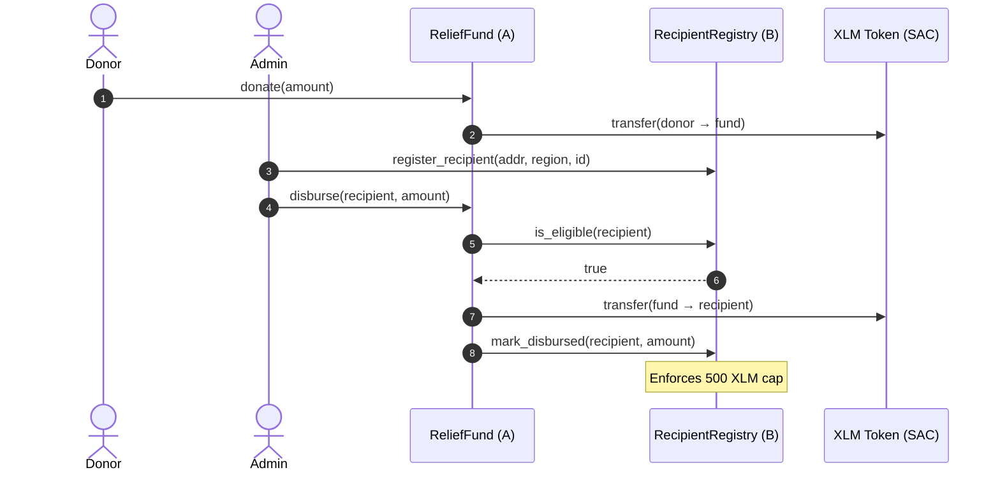

# 🚄 Disaster Relief Rail 

---

Disaster Relief Rail is a direct, transparent aid disbursement dApp built on the **Stellar Soroban testnet**. It enables relief organizations to pool donor contributions in a transparent smart contract and disburse aid directly to verified recipient wallets — with full public cryptographic auditability, real-time analytics, error monitoring, and a first-class mobile experience.

---

## 📸 Screenshots

### Before Connection


### After Wallet Connection


### Wallet Options


### Deployed Contract Address


### CI/CD Pipeline


---

## 🔗 Live Demo & Video Walkthrough

- **🌐 Live App**: [disasterreliefrail.vercel.app](https://disasterreliefrail.vercel.app/)
- **🎥 Demo Video**: [Watch on Google Drive](https://drive.google.com/file/d/1OesXyUfTkd8ADd_GOIDWRc4BcUwIrCA6/view?usp=drive_link)

---

## 🌍 The Vision & Mission

Traditional disaster relief is often plagued by high administrative overhead, delays, and opacity. **Disaster Relief Rail** solves this with a direct line between donors, organizations, and recipients:

1. **Direct** — Bypasses banking intermediaries and middlemen.
2. **Transparent** — Every donation, registration, and disbursement is recorded on-chain.
3. **Auditable** — Anyone can verify aid reached verified victims via the public history feed.

---

## 🧬 Architectural Evolution (Level 1 → Level 4)

| Level | What Changed |
|-------|-------------|
| **L1** | Basic wallet-to-wallet payment interface |
| **L2** | Single `ReliefFund` smart contract with pooling |
| **L3** | Two contracts (`ReliefFund` + `RecipientRegistry`) with inter-contract calls |
| **L4** | Production-MVP: hardened contracts, skeleton loaders, onboarding, feedback, analytics, error tracking, full mobile responsiveness |

---

## 📐 Smart Contract Architecture

Two contracts communicate via **inter-contract calls** on Soroban:

### 1. RecipientRegistry Contract (Contract B)
- Manages recipient metadata and verification registry
- Enforces a global **500 XLM max disbursement cap** per recipient
- Uses typed `#[contracterror]` enum for machine-readable error codes

### 2. ReliefFund Contract (Contract A)
- Manages donor deposits and financial aid custody
- On `disburse()`, cross-calls RecipientRegistry to confirm eligibility and record the payout



---

## 📋 Deployed On-Chain Configuration (Testnet)

| Component | Identifier |
|-----------|-----------|
| **ReliefFund Contract (A)** | `CCZT3C7MYAP7QPN6ADIQOMJV6R5TMT24YNDQZBTOR7TBWULWCC6MLRUX` |
| **RecipientRegistry Contract (B)** | `CCVCY2LKPDN4PW27GPKRSBZKYEDQJ6PVQO55B2MOI3YQMLMQI6ZQ65GG` |
| **Admin Organization Address** | `GDR72LMKQGGZUE7TBIMEPSE3CZAEBDFLDSA5EI6F3A3QS2QPBHXRJPXJ` |
| **Native XLM SAC Contract** | `CDLZFC3SYJYDZT7K67VZ75HPJVIEUVNIXF47ZG2FB2RMQQVU2HHGCYSC` |
| **Stellar Expert — ReliefFund** | [View on Stellar Expert](https://stellar.expert/explorer/testnet/contract/CCZT3C7MYAP7QPN6ADIQOMJV6R5TMT24YNDQZBTOR7TBWULWCC6MLRUX) |
| **Stellar Expert — RecipientRegistry** | [View on Stellar Expert](https://stellar.expert/explorer/testnet/contract/CCVCY2LKPDN4PW27GPKRSBZKYEDQJ6PVQO55B2MOI3YQMLMQI6ZQ65GG) |

### 🔍 Real On-Chain Disbursement Audit
- **Disbursement Transaction Hash**: `8db7cb5d15b3afd9193dcfe570b67515fe15e2db0653ab4efcf6adf26df617c0`
- [View on Stellar Expert](https://stellar.expert/explorer/testnet/tx/8db7cb5d15b3afd9193dcfe570b67515fe15e2db0653ab4efcf6adf26df617c0)

---

## 🛠️ Setup & Execution

### Prerequisites
- **Rust 1.96+** with `wasm32-unknown-unknown` target
- **Stellar CLI v27+**
- **Node.js 24+** and **npm 11+**
- **Freighter** or **xBull** wallet browser extension

### 1. Environment Variables

Copy the example env file and fill in your keys:
```bash
cp .env.example .env
```

Edit `.env`:
```env
VITE_POSTHOG_KEY=phc_your_key_here        # from posthog.com
VITE_POSTHOG_HOST=https://app.posthog.com
VITE_SENTRY_DSN=https://...@sentry.io/...  # from sentry.io
VITE_FORMSPREE_ID=xpwzabcd                 # from formspree.io
```

If any key is omitted, the corresponding feature silently disables itself (no errors).

### 2. Run Frontend Locally
```bash
npm install
npm run dev
# → http://localhost:5173
```

### 3. Run Tests
```bash
# Frontend unit tests (Vitest)
npm run test -- --run

# Rust contract tests (10 passing)
cargo test

# Lint
npm run lint
```

### 4. Build Contracts
```bash
cargo build --target wasm32-unknown-unknown --release
stellar contract optimize --wasm target/wasm32-unknown-unknown/release/recipient_registry.wasm
stellar contract optimize --wasm target/wasm32-unknown-unknown/release/relief_fund.wasm
```

### 5. Deploy & Initialize Contracts
```bash
# Deploy RecipientRegistry
stellar contract deploy \
  --wasm target/wasm32-unknown-unknown/release/recipient_registry.optimized.wasm \
  --source-account deployer --network testnet

# Deploy ReliefFund
stellar contract deploy \
  --wasm target/wasm32-unknown-unknown/release/relief_fund.optimized.wasm \
  --source-account deployer --network testnet

# Initialize RecipientRegistry
stellar contract invoke \
  --id <REGISTRY_ID> --source-account deployer --network testnet \
  -- init \
  --admin $(stellar keys address deployer) \
  --fund_contract <FUND_ID> \
  --max_cap 5000000000

# Initialize ReliefFund
stellar contract invoke \
  --id <FUND_ID> --source-account deployer --network testnet \
  -- init \
  --admin $(stellar keys address deployer) \
  --token CDLZFC3SYJYDZT7K67VZ75HPJVIEUVNIXF47ZG2FB2RMQQVU2HHGCYSC \
  --registry <REGISTRY_ID>
```

---

## 📊 Analytics Integration (PostHog)

**Tool**: PostHog free tier ([posthog.com](https://posthog.com))

**What's tracked and why**:

| Event | Why |
|-------|-----|
| `page_view` | Understand overall traffic and session volume |
| `wallet_connected` | Measure onboarding funnel entry rate |
| `donation_submitted` | Track donor conversion |
| `disbursement_submitted` | Track admin activity |
| `recipient_registered` | Track registry growth |
| `feedback_submitted` | Measure feedback engagement rate |

**Privacy**: `autocapture: false` — only explicit named events are sent. No PII (wallet addresses are only used as PostHog `distinct_id` for session continuity, not as human-identifiable data). No session recording.

**Setup**:
1. Create a free project at [posthog.com](https://posthog.com)
2. Copy your Project API Key
3. Add to `.env`: `VITE_POSTHOG_KEY=phc_...` and `VITE_POSTHOG_HOST=https://app.posthog.com`

---

## 🚨 Error Tracking / Monitoring (Sentry)

**Tool**: Sentry free tier ([sentry.io](https://sentry.io))

**What's captured**:
- Failed Soroban contract calls (simulation errors, tx failures)
- Unexpected network/RPC errors
- Unhandled JavaScript exceptions

**What's NOT captured**:
- User-rejected wallet signings (`USER_REJECTED`)
- Pre-validation errors (insufficient balance, cap exceeded — these are expected states shown to the user)

**Setup**:
1. Create a free React project at [sentry.io](https://sentry.io)
2. Copy your DSN from Project Settings → Client Keys
3. Add to `.env`: `VITE_SENTRY_DSN=https://...@sentry.io/...`

---

## 💬 Feedback Collection (Formspree)

**Tool**: Formspree free tier ([formspree.io](https://formspree.io)) — 50 submissions/month, no backend required.

**The 3 questions asked**:
1. How easy was this to use? (1–5 stars)
2. Did anything break or confuse you? (freetext)
3. What would you want this to do next? (freetext)

**Setup**:
1. Create a free account at [formspree.io](https://formspree.io)
2. Create a new form → copy the form ID (the part after `/f/` in the endpoint)
3. Add to `.env`: `VITE_FORMSPREE_ID=xpwzabcd`

Without the ID, submissions are logged to browser console (safe dev mode).

---

## 🎓 First-Time Onboarding

A dismissible overlay is shown to first-time visitors explaining:
1. **Connect Your Wallet** — Install Freighter or xBull
2. **Donate or Get Registered** — Donors send XLM, orgs register recipients
3. **Funds Move On-Chain** — Code enforces all rules, no middlemen
4. **Track Everything** — Public history feed, auditable on Stellar Expert

Dismissed state persists in `localStorage` (`reliefRailOnboardingSeen`). To re-show during testing, run `localStorage.removeItem('reliefRailOnboardingSeen')` in the browser console.

---

## 🚨 Production Error States Handled

| Error | Handling |
|-------|---------|
| Wallet not installed | Human-readable prompt with install link |
| User rejected signing | Caught, shown to user, not sent to Sentry |
| Insufficient wallet balance | Pre-check with exact balance shown |
| Insufficient fund balance | Pre-check with exact available amount |
| Recipient not registered | Contract error parsed and shown |
| Disbursement cap exceeded | Pre-check with exact remaining amount |
| RPC/network failure | Friendly message, captured in Sentry |
| Already registered | Contract typed error, human-readable message |


---

## 📋 User Onboarding Proof

`[TO ADD — Evidence of at least 10 real users interacting with the deployed app]`

---

## 💬 Feedback Summary

`[TO ADD — Summary of feedback responses received from real users]`

---

## 🔀 Git Commit History

This project follows a clean, granular commit history:

1. `feat(contracts)` — Typed contracterror enums + human-readable frontend error parsing
2. `feat(ui)` — Skeleton loaders and loading states for all async actions
3. `feat(ux)` — First-time onboarding overlay with 4-step explainer
4. `feat(feedback)` — Floating feedback widget via Formspree
5. `feat(analytics)` — PostHog integration for privacy-friendly usage tracking
6. `feat(monitoring)` — Sentry error tracking integration
7. `fix(mobile)` — Comprehensive 375px/414px responsive audit
8. `docs` — Level 4 README with all integrations documented
