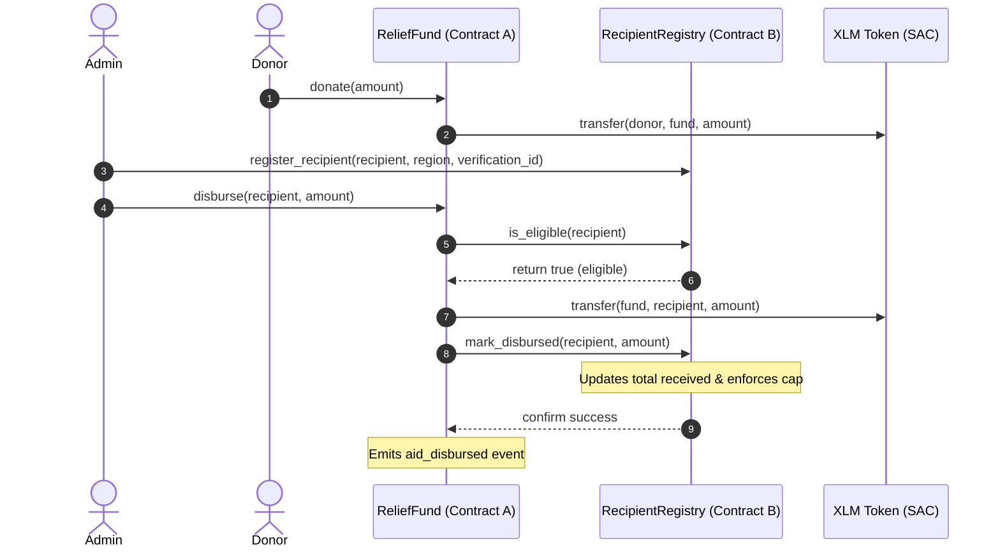

# 🚄 Disaster Relief Rail — Level 3 Production Aid dApp

Disaster Relief Rail is a direct, transparent aid disbursement dApp built on the **Stellar Soroban testnet**. It enables relief organizations to pool donor contributions in a transparent smart contract and disburse aid directly to verified recipient wallets, providing public cryptographic auditability.

---

## 🌍 The Vision & Mission

Traditional disaster relief is often plagued by high administrative overhead, delays, and a lack of visibility, meaning donor funds can disappear into opaque accounts before reaching victims. 

**Disaster Relief Rail** solves this by establishing a direct line between donors, organizations, and recipients. By utilizing a Soroban smart contract as the custody engine, aid disbursements are:
1. **Direct**: Bypasses banking intermediaries and middlemen.
2. **Transparent**: Every donation, recipient registration, and disbursement is recorded on-chain.
3. **Auditable**: A public feed of disbursements allows anyone to verify that aid funds reached verified victims.

---

## 🧬 Architectural Evolution (Level 1 to Level 3)

- **Level 1 (Direct Payments)**: A basic wallet-to-wallet payment interface where the relief organization connected their wallet and made direct payments to victims. This proved the feasibility of direct aid but lacked pooling mechanics and structured recipient auditing.
- **Level 2 (Contract-Managed Fund)**: Introduced a single `ReliefFund` smart contract. Donors deposited funds directly into the contract. The organization's admin registered verified recipient wallets and authorized disbursements from the pooled contract funds, emitting on-chain events for public transparency.
- **Level 3 (Modular Production System)**: Splits responsibilities across two independent smart contracts (`ReliefFund` and `RecipientRegistry`) that call each other. This separates financial custody from recipient metadata and verification logic.

---

## 📐 Advanced Smart Contract Architecture

The system utilizes two smart contracts communicating via **inter-contract calls** on Soroban:

### 1. RecipientRegistry Contract (Contract B)
*   **Role**: Manages recipient metadata and verification registry.
*   **Storage**: Tracks region, verification ID, status, and cumulative received amount per address.
*   **Enforcement**: Restricts registration to the authorized Admin and enforces a global **maximum disbursement cap** (e.g. 500 XLM) per recipient to prevent double-dipping.

### 2. ReliefFund Contract (Contract A)
*   **Role**: Manages donor deposits and financial aid custody.
*   **Inter-contract Call**: On `disburse()`, the ReliefFund contract calls `RecipientRegistry` to:
    1. Confirm the recipient is registered and verified (`is_eligible`).
    2. Record the payout and check that the disbursement doesn't exceed the recipient's cap (`mark_disbursed`).

### Inter-Contract Communication Flow Diagram



---

## 📋 Deployed On-Chain Configuration (Testnet)

| Component | Testnet Identifier / Link |
|-----------|--------------------------|
| **ReliefFund Contract (Contract A)** | `CCOVECQML366A4MIAFAWDMO6XAMJRDWIYMHFUOAQFH57CPSYODFNX3T4` |
| **RecipientRegistry Contract (Contract B)** | `CASCLD3F7MDSFWYKE55G7ELYWTCHE5PR3PUUWSNFBYE24I2ZVL3EQQ7Z` |
| **Admin Organization Address** | `GAGQNYTIAVTZP6U3GOW3TUZ344UFOEKNZGRC6E2TWZ22PGAPL56Y3WRT` |
| **Native XLM SAC Contract** | `CDLZFC3SYJYDZT7K67VZ75HPJVIEUVNIXF47ZG2FB2RMQQVU2HHGCYSC` |
| **Stellar Expert Fund Contract Link** | [View ReliefFund on Stellar Expert](https://stellar.expert/explorer/testnet/contract/CCOVECQML366A4MIAFAWDMO6XAMJRDWIYMHFUOAQFH57CPSYODFNX3T4) |
| **Stellar Expert Registry Contract Link** | [View RecipientRegistry on Stellar Expert](https://stellar.expert/explorer/testnet/contract/CASCLD3F7MDSFWYKE55G7ELYWTCHE5PR3PUUWSNFBYE24I2ZVL3EQQ7Z) |

### 🔍 Real On-Chain Disbursement Audit
*   **Disbursement Transaction Hash**: `aa0af3dcd8284ee15ec772dc9786e356bd4512a503005bd4b008f2c1de3ba200`
*   **Stellar Expert Transaction Link**: [View Audit Trail on Stellar Expert](https://stellar.expert/explorer/testnet/tx/aa0af3dcd8284ee15ec772dc9786e356bd4512a503005bd4b008f2c1de3ba200)

---

## 🛠️ Setup & Execution

### Prerequisites
- **Rust 1.96+** with `wasm32-unknown-unknown` target.
- **Stellar CLI v27+** (for contract interaction and deployment).
- **Node.js 24+** and **npm 11+**.
- **Freighter Wallet** or **xBull Wallet** browser extensions.

### 1. Build and Test Smart Contracts
Navigate to the root workspace directory and run:
```bash
# Run Cargo unit tests for both contracts (7 passing tests)
cargo test

# Build WASM targets
cargo build --target wasm32-unknown-unknown --release

# Optimize WASM sizes for Soroban
stellar contract optimize --wasm target/wasm32-unknown-unknown/release/recipient_registry.wasm
stellar contract optimize --wasm target/wasm32-unknown-unknown/release/relief_fund.wasm
```

### 2. Deploy and Initialize Contracts
Deploy both WASM files to Testnet, then initialize them:
```bash
# Deploy RecipientRegistry
stellar contract deploy \
  --wasm target/wasm32-unknown-unknown/release/recipient_registry.optimized.wasm \
  --source-account deployer \
  --network testnet

# Deploy ReliefFund
stellar contract deploy \
  --wasm target/wasm32-unknown-unknown/release/relief_fund.optimized.wasm \
  --source-account deployer \
  --network testnet

# Initialize RecipientRegistry (Link it to ReliefFund address & set max cap)
stellar contract invoke \
  --id CASCLD3F7MDSFWYKE55G7ELYWTCHE5PR3PUUWSNFBYE24I2ZVL3EQQ7Z \
  --source-account deployer \
  --network testnet \
  -- \
  init \
  --admin $(stellar keys address deployer) \
  --fund_contract CCOVECQML366A4MIAFAWDMO6XAMJRDWIYMHFUOAQFH57CPSYODFNX3T4 \
  --max_cap 5000000000 # 500 XLM max cap

# Initialize ReliefFund (Link to RecipientRegistry & XLM SAC)
stellar contract invoke \
  --id CCOVECQML366A4MIAFAWDMO6XAMJRDWIYMHFUOAQFH57CPSYODFNX3T4 \
  --source-account deployer \
  --network testnet \
  -- \
  init \
  --admin $(stellar keys address deployer) \
  --token CDLZFC3SYJYDZT7K67VZ75HPJVIEUVNIXF47ZG2FB2RMQQVU2HHGCYSC \
  --registry CASCLD3F7MDSFWYKE55G7ELYWTCHE5PR3PUUWSNFBYE24I2ZVL3EQQ7Z
```

### 3. Run Frontend Dashboard Locally
Navigate to the `frontend` folder:
```bash
# Install dependencies
npm install

# Run frontend tests
npm run test -- --run

# Run linter
npm run lint

# Run local development server
npm run dev
```

---

## 🚨 Production Error States Handled

1.  **Wallet Not Found**: Gracefully prompts the user if neither Freighter nor xBull is installed.
2.  **User Rejected Signing**: Catches signing rejections from Freighter/xBull and reverts to input without locking the UI.
3.  **Insufficient Wallet Balance**: Donor-side precheck verifying they have enough funds to cover the donation amount.
4.  **Insufficient Contract Balance**: Admin-side precheck verifying the contract pools hold enough XLM to execute the disbursement.
5.  **Recipient Not Registered/Eligible**: Reverts simulation if attempting to disburse to an address not registered in `RecipientRegistry`.
6.  **Disbursement Cap Exceeded**: Precheck and contract enforcement preventing disbursements that exceed the **500 XLM** limit per recipient.
7.  **Network/RPC Failure**: Custom alerts for Horizon or Soroban RPC node timeout states.

---

## 📸 Screenshots

### 1. Mobile Interface (375px Fluid Stacking Layout)


### 2. CI/CD GitHub Actions Pipeline passing build and test checks

*(Note: Screenshots are cached by Github Camo and use unique names for instant cache busting.)*
